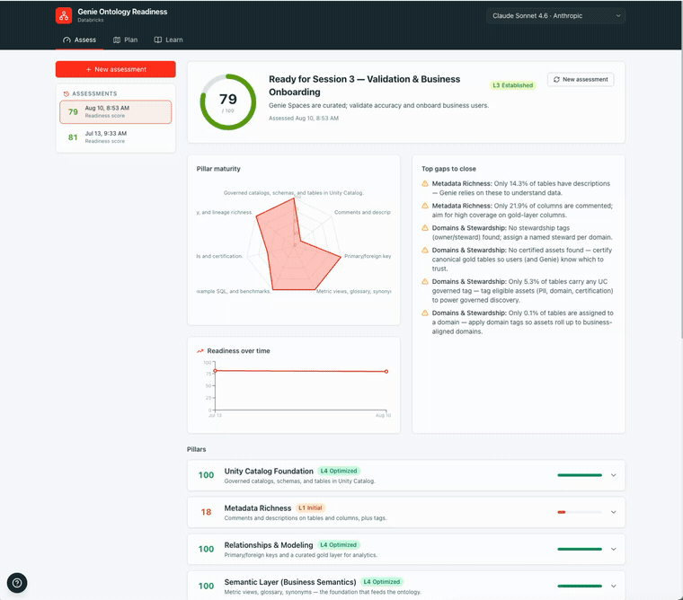
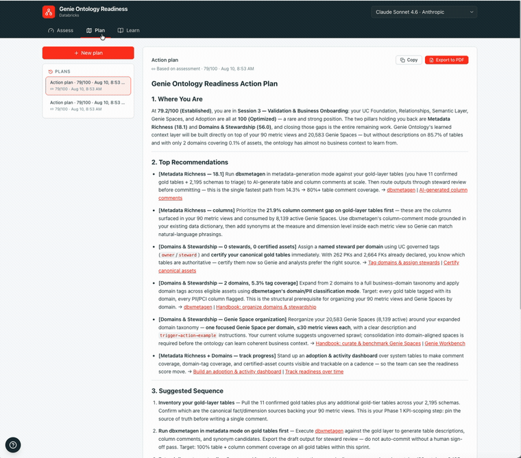
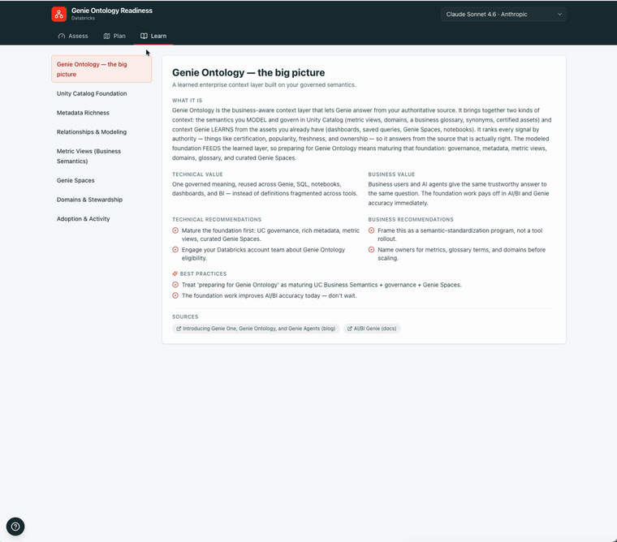

# Genie Ontology Readiness

> **This is an enhanced fork** of the Databricks Solutions accelerator
> [`databricks-solutions/genie-ontology-readiness`](https://github.com/databricks-solutions/genie-ontology-readiness),
> maintained under `gurpreetseth-db`. It preserves the upstream `LICENSE.md` / `NOTICE.md`
> and adds **entity-level (catalog → schema → entity → column) assessment**, **Excel report
> export**, and a **Generate** tab that drafts the missing metadata with the customer's own
> LLM. See [Enhancements in this fork](#enhancements-in-this-fork).

A self-contained Databricks App that helps a customer **prepare for Genie Ontology**.
Deploy it into a workspace and it will:

- **Assess** the live environment and score maturity across the readiness pillars
  Genie Ontology depends on (Unity Catalog, metadata, relationships, metrics /
  metric views, Genie Agents, domains, adoption) — down to the **individual catalog,
  schema, entity and column**, and **download the detail as a multi-tab Excel report**.
- **Explain** each capability from a **technical** and a **business** standpoint, with
  accurate GA / preview status.
- **Recommend** best practices for both technical enablement and business adoption.
- **Generate** (1) a tailored, sequenced enablement + adoption plan, and (2) the **missing
  metadata itself** — descriptions, tags, column comments, PK/FK statements, Genie-agent
  instructions and metric-view definitions, drafted by the customer's **own Foundation
  Model API** and downloaded as an Excel workbook for review.

The assessment is **read-only** and degrades gracefully when a signal isn't available.
The Generate tab is **export-only** — it never writes to Unity Catalog.

## Enhancements in this fork

- **Entity-level assessment** (`app/server/assessment/detail.py`) — a row per catalog,
  schema, entity, uncommented column, PK/FK relationship, metric view, Genie Agent
  (instructions / example SQL / benchmarks) and non-certified asset, each with a pass/fail
  and a **Pillar** taken from the catalog governed tag (`pillar`, else `data_domain` /
  `business_domain` / `data_product`).
- **Excel report** — `POST /api/report/excel` (server-side `openpyxl`) and an
  **Export Excel** button on the Assess tab.
- **Generate tab** (`GenerateWizard.tsx`, `POST /api/generate/stream` →
  `GET /api/generate/excel/{token}`) — drafts the missing metadata via the workspace model
  picker and downloads a workbook with `Catalog`, `Schema`, `Entity`, `Entity_Columns`,
  `Relationship_PrimaryKey`, `Relationship_ForeignKey`, `GenieAgent` and `MetricViews` tabs.
  Every catalog, schema, entity and column is a **separate, grounded LLM call** (never a
  batch the model has to echo names back from), so one item's failure or rewording can
  never blank another item's fields. PK/FK suggestions are heuristic — review before applying.

  **Model invocation goes through `ai_query()` on the SQL warehouse** (`execute_sql`), the
  same call path the entity-level assessment itself uses — **not** a direct REST call to
  `/serving-endpoints/.../invocations` (the path Plan's chat uses). This mirrors the proven
  pattern in `app/accelerators/metadata-ai-comments/` (the Learn tab's "AI-generated,
  glossary-grounded column comments" accelerator, which calls `ai_query()` from
  `spark.sql()`). Two earlier iterations of this endpoint used the REST/streaming path and,
  even after fixing a real batching bug plus case-sensitive key matching and reply
  truncation, every generated field still came back blank — evidence pointing at the
  REST/streaming call itself rather than the JSON-parsing layer on top of it. Generation is
  also resilient to how the model replies: a **case/alias-tolerant field lookup** (a
  capitalized `"Description"` or renamed `"desc"` key still reads correctly) and a **one-shot
  retry with a stricter reminder** when a reply isn't valid JSON. Any item that still comes
  back blank after both attempts is counted and surfaced in the completion banner ("N items
  could not be generated — see the app logs for why") instead of failing silently.
- **Shared workspace + catalog scope** (`hooks/useWorkspaceScope.ts`, owned by `AppShell` in
  `App.tsx`) — pick catalogs **once** and it applies to both the Assess and Generate tabs
  (Plan needs no scope of its own; it works off whatever scorecard Assess already produced).
  Previously each tab held its own independent copy and re-fetched `/workspaces` +
  `/catalogs` separately, so a catalog selection on one tab had no effect on the other.

> **Note on Pages:** Genie Ontology *Pages* are a gated preview with no public list API, so
> Page coverage is reported as "not assessable" rather than a misleading zero.

> Genie Ontology is the *learned* enterprise context layer (gated preview) built on the
> customer's *governed* UC Business Semantics foundation (largely GA). Preparing for it =
> maturing that foundation. See `CLAUDE.md` for the product framing and full deploy steps.

## Walkthrough

The app has four tabs (Assess · Plan · Generate · Learn). Each walkthrough below is a short, sped-up screen capture.

### Assess — the 7-pillar readiness scorecard

Run a read-only assessment that scores your workspace across seven pillars, rolls up to a
0–100 readiness score and maturity stage, and expands each pillar to its signals and gaps.



### Plan — a tailored action plan

Generate a prioritized, tactical action plan from a saved assessment — grounded in your real
scores and gaps and powered by your workspace's own Foundation Model API.



### Learn — enablement and accelerators

Explore each capability from a technical and a business angle, with best practices, downloadable
guides, and the public Databricks accelerators that raise each pillar's score.



## Quick start

**Get the code.** For a **stable build**, clone the latest tagged
[release](https://github.com/databricks-solutions/genie-ontology-readiness/releases)
— this is the recommended source for customer deployments. For a **staging build**
with the newest, unreleased changes, clone `main` directly.

```bash
# Stable — latest release (recommended)
tag=$(gh release view --repo databricks-solutions/genie-ontology-readiness --json tagName -q .tagName)
git clone --branch "$tag" https://github.com/databricks-solutions/genie-ontology-readiness.git
# (no gh? browse the Releases page above and: git clone --branch <tag> <repo-url>)

# Staging — latest main (newest, unreleased)
git clone https://github.com/databricks-solutions/genie-ontology-readiness.git
```

Then build and deploy:

```bash
cd app/frontend && npm install && npm run build && cd ../..
databricks bundle deploy -t dev --profile <p> --var="warehouse_id=<id>"
DATABRICKS_PROFILE=<p> TARGET=dev WAREHOUSE_ID=<id> python3 scripts/post_deploy.py
```

The `-t <target>` selects the environment and fixes the app name (`dev`, the
default → `genie-ontology-readiness-dev`, `stg` → `…-stg`, `prod` → the bare
`genie-ontology-readiness`). There is no `--var app_name` — the name is pinned
per target so a deploy can never rename or delete another environment's app. Keep
`TARGET` in step 2 matching the `-t` in step 1. **For a production install**, use
`-t prod` (with `TARGET=prod`) to get the unsuffixed `genie-ontology-readiness`.

See **[CLAUDE.md](./CLAUDE.md)** for prerequisites, the service-principal grants the
assessment needs, local development, optional Lakebase history, and branding.

## Permissions required

The app reads only **metadata** (`information_schema`, tags) and **system tables**
(`system.access.*`, `system.query.*`) — never your actual table data. Every signal
defaults to **on-behalf-of-user (OBO)** with an automatic **SP fallback**:

- **Interactive** — a person viewing the app. With **on-behalf-of-user (OBO)**
  authorization enabled, **every signal runs as the viewing user** (their own Unity
  Catalog + system-table grants), so the assessment reflects exactly what *you* can
  see. If a given read fails because you lack a grant the app SP holds (system
  tables are the common case), that read **falls back to the app SP** rather than
  dropping the signal.
- **Scheduled / unattended** — snapshot history or any background run with no user
  present (also local dev). With no forwarded token every read runs as the app
  **service principal (SP)**, so the SP must hold the grants below.

A few reads are **always** the SP (they can't run OBO): the Genie REST API (not
covered by the `sql` user scope) and Lakebase credential minting.

### Who needs what

| Assessment area | Reads from | Grant needed (held by the **viewer** under OBO, or by the **SP** when unattended) |
|---|---|---|
| Run any query | SQL warehouse | `CAN USE` on the warehouse |
| UC Foundation · Metadata · Relationships · Metrics · Domains (tags) | catalog / `system.information_schema` | `BROWSE` on each assessed catalog (metadata-only, least privilege) — or `USE CATALOG`+`USE SCHEMA`+`SELECT` |
| "Not in Unity Catalog" coverage | `hive_metastore.information_schema` | read on `hive_metastore` (if legacy access is enabled) |
| Genie Agents (count + activity) | `system.access.audit` (`aibiGenie` events) | `USE`+`SELECT` on `system.access` |
| Adoption & Activity | `system.access.audit`, `system.query.history` | `USE`+`SELECT` on `system.access` and `system.query` |
| Top‑10 most‑accessed + certified | `system.access.table_lineage` + `information_schema.table_tags` | `USE`+`SELECT` on `system.access` + catalog metadata |
| Plan / Assistant (LLM) | Foundation Model API | model serving / FMAPI enabled for the workspace |
| Generate (LLM metadata drafting) | `ai_query()` via the SQL warehouse | `CAN USE` on the warehouse + `CAN QUERY` on the target serving endpoint. Requires a **Pro or Serverless** SQL warehouse (`ai_query` isn't available on Classic). Unlike Plan, this does **not** call `/serving-endpoints/.../invocations` directly — see [Enhancements in this fork](#enhancements-in-this-fork). |

> [!NOTE]
> **SP fallback.** Under OBO each signal is attempted **as the viewer first**. If
> that read fails — most commonly because the viewer lacks a grant the app SP holds
> (system tables such as `system.access` / `system.query`) — the app **transparently
> retries the same read as the service principal** instead of dropping the signal.
> This means a signal can appear in the assessment even when the viewer can't read
> it directly, *provided the SP is granted*. If neither the viewer nor the SP holds
> the grant, the signal degrades to "not available." The fallback is per-read and
> lives in `app/server/sql_client.py` (`execute_sql`); the SP-only reads that never
> attempt OBO (Genie REST, Lakebase) are opted out with `force_sp=True`.
>
> **SP-only mode.** To disable OBO entirely at deploy time, set the `FORCE_SP=true`
> env (in `app.yml`, or `export FORCE_SP=true` before `post_deploy.py`). Every read
> then runs as the app SP regardless of any forwarded viewer token — useful when you
> want consistent, workspace-wide system-table signals (e.g. Adoption) that don't
> vary by who's viewing. The SP must hold the grants below. Default is `false`.

`scripts/setup_app_permissions.py` (run by `post_deploy.py`) applies the SP grants; see
**[CLAUDE.md](./CLAUDE.md)** for the exact statements and the OBO details.

## Stack

FastAPI + React/Vite + Tailwind, deployed as a Databricks App via Databricks
Asset Bundles.

## License

Provided under the **Databricks License** — see [`LICENSE.md`](./LICENSE.md) and
[`NOTICE.md`](./NOTICE.md). Third-party dependencies are subject to their own licenses,
declared in the respective package manifests.

## Support

This project is a Databricks **Field Engineering solutions example**, published as a
demonstration accelerator. It is **not** an official Databricks product and is **not**
covered by any Databricks Support agreement, SLA, or warranty.

- **Provided AS-IS**, with no warranties or conditions of any kind. There are **no SLAs**
  and no commitment to maintenance, bug fixes, or future updates.
- **Community / field-maintained** on a best-effort basis by the owner below — not
  staffed by Databricks Support or Engineering.
- **Not a substitute for official guidance.** Validate GA / preview status against the
  official [Databricks documentation](https://docs.databricks.com/) before making
  decisions.
- To report a security issue, see [`SECURITY.md`](./SECURITY.md).

For questions or issues, **open an issue on this repository** or contact the maintainer:
**Allan Cao** (`allan.cao@databricks.com`). See [`NOTICE.md`](./NOTICE.md) for the full
disclaimer.
